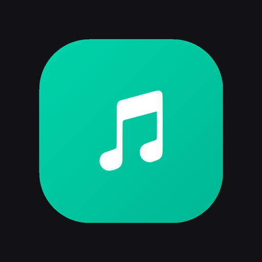

<p align="center">
  
</p>

<h1 align="center">JLTamp Server</h1>

<p align="center">
  <b>Self-hosted music server — the backend for the JLTamp app.</b><br>
  Think <i>Plex / Jellyfin, but focused on music</i>.
</p>

<p align="center">
  <a href="https://play.google.com/store/apps/details?id=com.jltamp.app">
    
  </a>
  
  
  
</p>

---

Stream your own music library to the JLTamp app or any browser, from a server you
run yourself. No ads, no tracking, no subscription — your library and your
listening data stay on your own machine.

JLTamp does not provide, host, or distribute any music. It only plays media from
**your** server, using **your own** files.

**Get the app:** [JLTamp on Google Play](https://play.google.com/store/apps/details?id=com.jltamp.app).
Point it at your server and you're done. The web player is bundled with this
repo, so a browser works without installing anything.


---

## What you get

JLTamp is two halves: **this server**, which owns your files and your data, and
the **app**, which is the part you actually touch. Below is what each side does
and how the pieces fit together.

### Your library

Point the server at a folder and it scans what's there — MP3, FLAC, ALAC, WAV,
AAC, OGG and Opus. Libraries work like Plex's: add as many as you want, browse
to the folder in the built-in file browser instead of typing paths, and rescan
on demand. Rescans are incremental, so a library with tens of thousands of
tracks doesn't get re-read from scratch every time.

Album art and artist images are fetched from public music databases. Folders of
loose singles get grouped into one collection per folder instead of littering
your library with hundreds of one-track albums. **Your music is mounted
read-only** — the server never writes to it.

### Listening

The player does the things you'd expect and a few you might not:

- **Crossfade** between tracks, with adjustable length and five fade styles that
  shift *when* the blend happens — from a long, lingering overlap to nearly
  gapless. The fade runs natively, so it keeps going with the screen off.
- **Volume normalisation**, so a quiet album doesn't disappear after a loud one.
- **Gapless-feeling queue** with shuffle, repeat, and a queue you can reorder.
- **Offline downloads** — take playlists or liked songs with you and play them
  with no server in reach.
- **Lyrics**, shown alongside the track.
- **Quality selection**, so you can stream lighter on mobile data.

### Listen Together

Start a session, share it, and everyone hears the same thing at the same moment.
The host controls playback; guests follow along. It's not "we both pressed play
at once" — the server keeps positions in sync, and there's a per-device offset
setting for when one speaker lags behind another.

Everyone in the session can react with an emoji or a short typed line, which
floats up over the player on everyone's screen. You can see who else is
listening, and what they're listening to.

### In the car

Full **Android Auto** support: browse your libraries, playlists, liked songs and
queue from the car screen, with a like button right in the car UI. Skip, pause
and seek work from the steering wheel, a Bluetooth headset, a smartwatch or the
lock screen — anything that speaks AVRCP.

Music pauses when you leave the car and resumes when you get back in, and JLTamp
publishes exactly one media session so you never get two players fighting over
your lock screen.

### Around the house

- **Chromecast** — send playback to a TV or speaker; the app becomes the remote.
- **Handoff** — start a track on your phone, pick it up on the web player or
  another device from the same position.
- **AirPlay route picker** on supported hardware.

### Sharing and discovery

- **Playlists**, including **shared playlists**: hand someone a share code and
  they can join and add tracks. Every entry records who added it.
- **Rebuild a playlist from a link** — paste one, and the server matches the
  track list against files you already own.
- **On this day** — what you were playing a year ago.
- **Year in review** — your listening summed up, shareable.
- **Stats** — top artists, tracks, and listening time.

### DJ mode

Two decks with a real crossfader. Load a track into A and B, play them
independently, and blend by hand. Each deck is drawn as a spinning record that
lights up while it plays. The main player pauses while you're in there and the
decks are released when you leave.

### The optional AI engine

A separate, **also self-hosted** service (`ai/`) that you can skip entirely. When
it's running it adds weekly playlists built from your own listening, genre
inference for files with missing tags, and a radio mode that steers by tempo and
mood. It talks to your server and nothing else — no listening data leaves your
network, because there is nowhere else for it to go.

### Accounts and access

Multi-user and invite-based: you invite someone by email, they pick their own
password. Every user gets their own likes, playlists and history. Admins manage
users and libraries, and library access is per user — you decide who sees what.
Passwords are hashed, each device gets its own token, and artwork is access-
controlled so nobody can pull the cover of a playlist they're not part of.

### Making it yours

Accent colour (presets or a custom one), a choice of twelve animated
backgrounds, an avatar, and the interface in your own language. The web player
adapts to phones, tablets and desktop.

---

## Features

- 🎵 Stream your own library (MP3, FLAC, ALAC, WAV, AAC, OGG, Opus, …)
- 👥 Multi‑user, invite‑based — everyone gets their own account
- ❤️ Per‑user liked songs, playlists and play history
- 🗂️ Plex‑style libraries with a **folder browser** + on‑demand scanning
- 🖼️ Automatic album art & artist images (fetched from public music databases)
- 📥 Rebuild a playlist from a shared link by matching its track list to your own files
- 🚀 **Set up in the browser** — first‑run wizard creates your admin account
- 📱 Works with the **JLTamp app** (Android + web)
- 🔒 Passwords hashed, per‑user tokens, music mounted **read‑only**

---

## Quick start (Docker)

You need [Docker](https://docs.docker.com/get-docker/) with Compose.

```bash
git clone https://github.com/JDJelectronics/JLTamp-server.git
cd JLTamp-server
```

1. Open `docker-compose.yml`, **mount your own music folder**, and set a
   username/password. The server ships with **no music of its own** — you point
   it at a library you already have on the server (a local disk, an external
   drive, or a NAS share mounted on the host). It is mounted **read‑only**, so
   the server can never modify or delete your files:

   ```yaml
   environment:
     SERVER_NAME: "My Music"
     # No password here — you create your admin account in the browser on first
     # run (step 3). Optionally set JLTAMP_PASSWORD for a fixed backup admin.
   volumes:
     - /path/to/your/music:/music:ro     # ← EDIT: your own music folder (read-only)
     - jltamp-data:/data                 # server DB + artwork cache
   ```

   Replace `/path/to/your/music` with the real path on your machine, e.g.
   `/home/you/Music`, `/mnt/media/music`, or a mounted network share. The `:ro`
   suffix keeps it read‑only — leave it in place.

2. Start it:

   ```bash
   docker compose up -d --build
   ```

3. Open **http://localhost:32400** in a browser. The **JLTamp web app is bundled
   with the server** and loads straight away — no separate frontend to install,
   no address to type. It talks to whatever origin served it, so `localhost`
   (and your LAN IP, or your own domain behind a reverse proxy) just works.
   **On first run it shows a quick setup wizard** — create your admin account
   (email + password) right there and you're in. (No wizard if you set a
   `JLTAMP_PASSWORD` — then just log in with that.)

4. In the web UI go to **Settings → Libraries** and **add a library**: a
   Plex‑style **folder browser** lets you click through the folders under your
   music mount (▸ to go into a folder, tap to select it), pick one or more, and
   run a **scan**. Your music then appears in the web app and the mobile app.
   From the same screen you can also **rebuild a playlist from a link** — the
   track list is matched against music you already have, nothing is fetched — and,
   if you run Plex, import your Plex playlists and likes.

Your music is mounted **read‑only** — the server never modifies your files. All
writable data (database, cached artwork, users, playlists, likes) lives in the
`jltamp-data` volume, so it survives rebuilds.

> **No hosted account, no domain required.** This is *your* server: you sign in
> against it directly (email + password). There is no external sign‑in and
> nothing phones home.

### Using a NAS

Mount your NAS share on the **host** (SMB/NFS/CIFS) and pass the mount point as
the `:/music:ro` volume — the server browses it like any other folder. The
folder browser is deliberately sandboxed to the mounted music path, so it can
never expose the rest of your filesystem.

There's a **“Discover NAS on my network”** button under *Settings → Libraries*
that lists NAS/file‑share devices found via mDNS — hints to help you find the
address to mount. It can’t mount shares for you (a read‑only container has no
business doing that), and on a default Docker **bridge** network mDNS is usually
blocked, so run the container with `network_mode: host` if you want discovery to
work. Mounting on the host is the reliable path either way.

---

## Connecting the app

Download the **JLTamp** app, choose *“Connect your own server”*, and enter your
server’s address (e.g. `http://192.168.1.10:32400` on your LAN, or your public
HTTPS URL if you expose it). Sign in with your account.

> The JLTamp app can also connect to a **Plex** server, if you already run one.

---

## Optional: AI DJ playlists

JLTamp has an optional **AI DJ**: describe a vibe (“a calm sunday morning with
coffee”) and get a playlist built from **your own** library. It runs as a
**separate, optional** service — the app and server work fully without it.

To enable it, run the AI engine included in this repo:

👉 See the **[`ai/`](ai/)** folder — a small semantic playlist engine that embeds
your library **locally** (nothing goes to the cloud). Full setup is in
[`ai/README.md`](ai/README.md).

In short: run the AI service, then either put it behind your reverse proxy under
`/ai/*` on the same domain as your server, or run it on your LAN / Tailscale on
port `5000`. The AI bar then appears in the app automatically.

---

## Configuration

All settings are environment variables (see [`.env.example`](.env.example)):

| Variable | Default | Description |
|---|---|---|
| `MUSIC_DIR` | `/music` | Path inside the container to your library (read‑only) |
| `DATA_DIR` | `/data` | Where the DB + artwork cache live |
| `JLTAMP_USERNAME` / `JLTAMP_PASSWORD` | `admin` / `changeme` | The seeded admin login — **change it** |
| `JLTAMP_ADMIN_EMAIL` | `admin@example.com` | Admin email (login + owner) |
| `SERVER_NAME` | `JLTamp` | Friendly name shown in the app |
| `JLTAMP_OPEN_REGISTRATION` | `false` | `true` = anyone can register; `false` = invite‑only |
| `JLTAMP_IMPORTERS` | `false` | `true` enables the playlist importers. Off = the endpoints answer 403 **and** the app hides the import cards, so no button offers what the server refuses |
| `PORT` | `32400` | HTTP port the server listens on |
| `LOCAL_URL` | *(blank)* | Optional LAN/Tailscale address(es) for faster local streaming |
| `SMTP_*` | *(blank)* | Optional SMTP for invites / password‑reset / welcome mail |
| `RESCAN_INTERVAL_MIN` | `0` | Auto‑rescan interval in minutes (`0` = manual only) |

### Optional: email (invites & password reset)

Set `SMTP_HOST`, `SMTP_PORT`, `SMTP_USER`, `SMTP_PASSWORD`, `SMTP_FROM` (and
`SMTP_SSL=true` for port 465) to enable invitations, password resets and the
welcome mail. Without SMTP, invites fall back to a link you copy by hand.

---

## Remote access

Simplest is to keep it on your LAN and reach it over
[Tailscale](https://tailscale.com/). To expose it publicly, put a reverse proxy
(e.g. Caddy / nginx) with HTTPS in front of the container — don’t expose the raw
port to the internet.

---

## Privacy

The server serves a template privacy policy at `/privacy`
(`app/static/privacy.html`) — edit the contact address before publishing.

## License

MIT — see [LICENSE](LICENSE).
